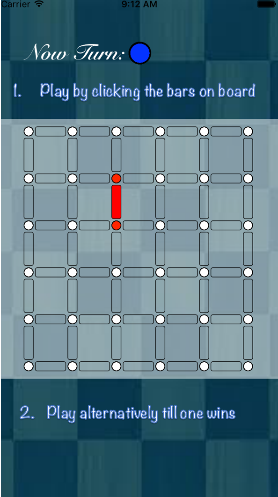
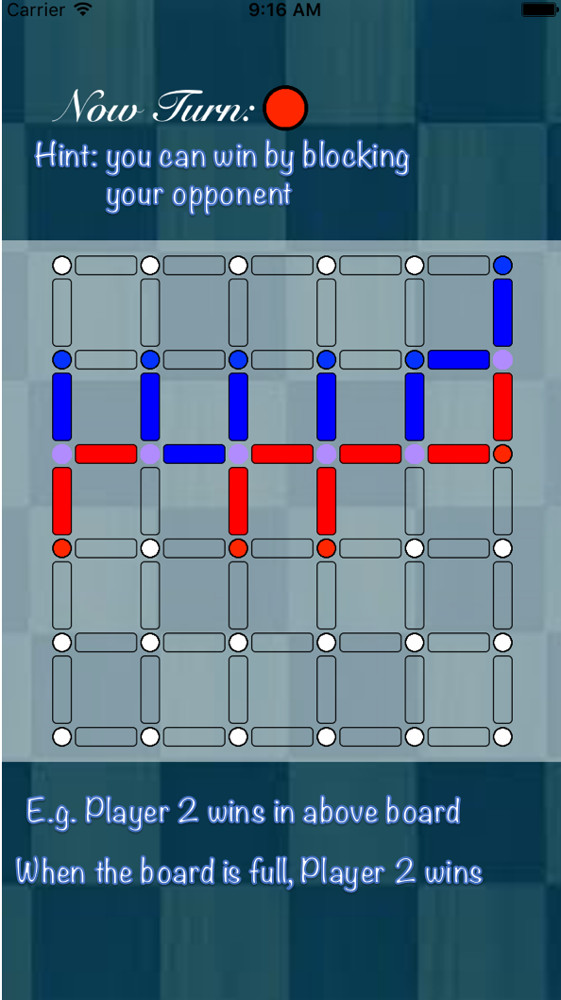

# Crox Game App

This is a repository for the VandyHack 2016.
All work here is finished with Dempsy95

## Introduction
This is an iOS board game we developed during the Vandy Hackathon in Fall 2016. The rule is pretty simple: each player plays alternatively till one wins. Player playes by choosing an edge in the board that has not been colored. Red edges represent player 1 and blue edges represent player 2.

The color of a dot indicate the color of its neighboring edges. The winning condition is also pretty simple: Player 1 wins by connecting the top border with the bottom border, and Player 2 wins by connecting the right border with the left border.

For example, in the following board, player 1 wins.

You can even win by blocking your opponent's way. Like this: 

In the above board, player 2 wins by blocking player 1's way. 

## Details

We implement Crox with xcode using swift 2.3 with xcode. We store points to represent each player's edges. We also used the idea of union find to combine connecting edges. To determine whether the game is over, we first check whether a player has connected his borders; then we test whether the whole board is full; finally, we check whether the board has been blocked. 

The difficulties of this app are the UI interface and the algorithm to check whether the board has been block. For the UI, we literally create hundreds of button in the board. For the algorithm, we perform a BFS from the starting points and check whether they can reach the other end. 

